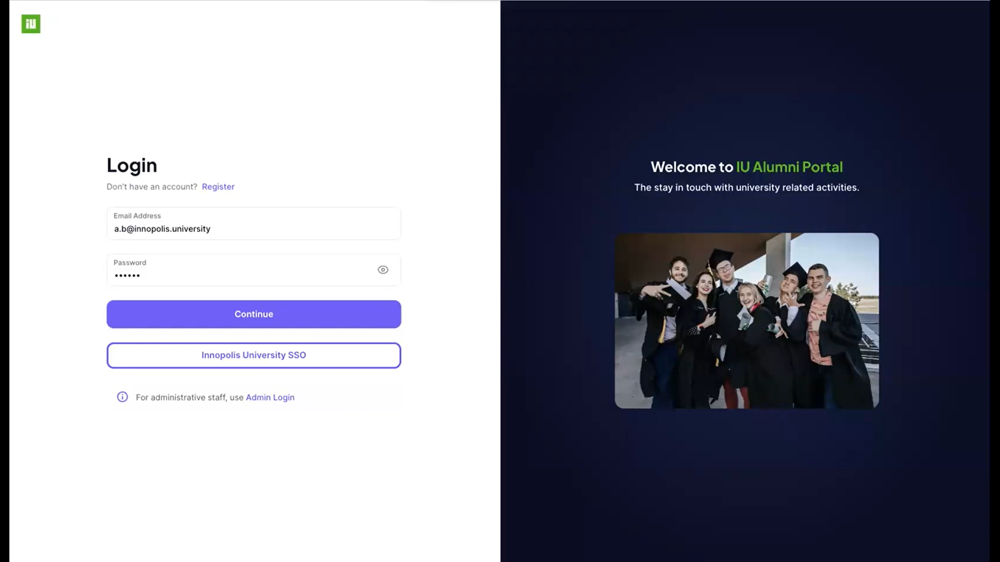

# Introduction

Inno Alumni Portal is a website providing services for Innopolis University alumni. It allows you to connect with other alumni, learn about events happening in the university, register for elective courses and request a pass to enter the university.

Visit it at [https://graduates.innopolis.university/](https://graduates.innopolis.university/) or [@InnoAlumniBot](https://t.me/InnoAlumniBot) on Telegram.

NOTE: unfortunately, you can't currently log into the website. We are working on solving the issue, you can follow the progress in [this issue](https://github.com/TheSharpOwl/inno-alumni-portal/issues/36).

## Features

- **Social**: connect with other alumni.
- **Events**: see the list of events happening in the university and register for them.
- **Courses**: register for elective courses.
- **Pass**: request a pass to enter the university.

## Technologies

- **Frontend**: Next.js, React
- **Backend**: Python FastAPI, Prisma, PostgreSQL
- **Deployment**: Docker

## How to use

1. Go to [https://graduates.innopolis.university/](https://graduates.innopolis.university/) and log in with your Innopolis University account by clicking the "Innopolis University SSO" button. This will create an account for you if you don't have one.

2. Using the sidebar on the left, navigate to "Account" page and fill in your personal info. This will allow other alumni to find you.

3. Use the sidebar or the "Overview" page to connect with people or access other features.